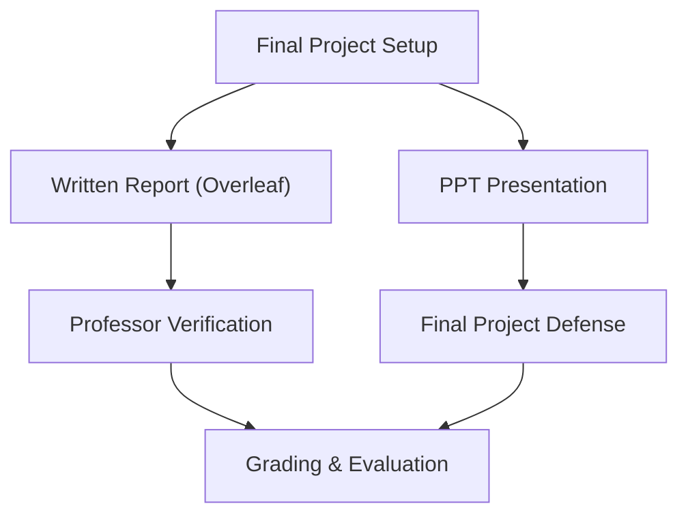

# 🎓 Final Project Information & Deliverables

This document consolidates the academic requirements, presentation structure, delivery pipeline, and deadlines for the **5th Semester Database Systems Final Project**.

---

## 📅 Schedule & Deadlines

> [!IMPORTANT]
> **Tentative Delivery Windows:**
> - **Start:** Last week of May
> - **Finish:** First week of June

*Note: The exact same process and milestones apply for the **Database Systems (DBS)** evaluation context.*

---

## 🏆 Key Deliverables



### 1. Academic Report
- **Medium:** LaTeX document authored via **Overleaf**.
- **Collaborator Setup:** 
  1. Create the project on Overleaf.
  2. Share the Overleaf Project ID / link.
  3. Once the project is fully completed, invite the professor's email as a collaborator with edit/review permissions so they can perform direct validation.

### 2. Slide Presentation (PPT)
The slide deck must adhere strictly to the following academic outline structure:

*   **a. Introduction**
    *   **i. What kind of project we'll do:** A secure, relational Human Resource & Access Control Management System, built using PostgreSQL (BCNF compliant), FastAPI backend API, and a React 19 Next.js frontend dashboard.
*   **b. Issues found**
    *   **i. What real-world issues were found:** legacy database redundancies causing insertion/update anomalies, insecure check-in methods (buddy-swiping, consecutive double entries), manual paper-based workflow delays, and unprotected sensitive resources (salaries, admin forms).
*   **c. Motivation**
    *   **i. What issues were addressed and how:** structural redundancy eliminated by decomposing schemas into Boyce-Codd Normal Form (BCNF), double entry fraud blocked by sequential validation layers on the server, operational delays solved by an interactive state-based leave request workflow, and security leaks resolved using cryptographically secure password hashing (bcrypt) and Role-Based Access Control (RBAC) via stateless JWT tokens.
*   **d. System design:** Functional Dependencies (FDs) mapping, relational database schemas, BCNF decomposition steps, FastAPI RBAC token validation middlewares, and client-side page rendering guards.
*   **e. Results:** Screenshots and descriptions of the active admin dashboard, interactive employee directory modals, live salary inline edits, virtual card check-in/out alert popups, and the Manager's leave requests workflow dashboard.
*   **f. Conclusion:** Project achievements (digital integration), system safety verification (ACID & BCNF), containerized deployment speed, and visual legibility enhancement for light/dark modes.
*   **g. References (optional):** Bibliography including database systems textbooks (Silberschatz) and technical API/Framework manuals.

---

## 🛠️ Project Execution Policy

- **Language Policy:** The final project can be implemented in **any programming language** (the current stack is built on Python FastAPI and Next.js React 19).
- **Core Requirements:**
  - Database schema normalized to **Boyce-Codd Normal Form (BCNF)**.
  - Full **Role-Based Access Control (RBAC)** validation layers.
  - Consistent **English-only protocol** for system schemas, codes, docs, and API payloads.

---

## 📊 PowerPoint Slide-by-Slide Content Guide

Use this detailed, slide-by-slide template to build your project presentation (PPT). Each slide corresponds to the required academic chapters with optimal presentation content.

```carousel
### 🛝 Slide 1: Title Slide (Portada)
*   **Slide Header:** Secure Relational Human Resource & Access Control System
*   **Subtitle:** A Modern Full-Stack RBAC HR Management System Normalized in BCNF
*   **Presenters:** UPTP 5th Semester Students (Insert your team names here)
*   **Course:** Database Systems II (DBS)
*   **Date:** May / June 2026
*   **Visual Suggestion:** A clean screen layout with the logos of UPTP, FastAPI, Next.js, and PostgreSQL.

<!-- slide -->
### 🛝 Slide 2: a. Introduction (Project Nature)
*   **Slide Header:** a. Introduction: Relational HR Ecosystem
*   **Core Message:** Transitioning from fragmented paperwork to a centralized database-driven secure platform.
*   **Main Features:**
    *   *Real-time Directory:* Instant search and secure inline edits.
    *   *Automated Swipe Clock:* Strict virtual swipe-card tracking.
    *   *Self-Service Workflow:* Employee leave applications with Manager approval flows.
*   **Academic Goal:** Demonstrate correct relational mapping, database normalization, and robust server-side transaction control.

<!-- slide -->
### 🛝 Slide 3: b. Issues Found (Real-World Problems)
*   **Slide Header:** b. Issues Found: Legacy Administrative Risks
*   **Key Pain Points Identified:**
    1.  *Data Redundancy:* Duplicate data in tables causing UPDATE and INSERT anomalies (e.g. updating a department name left old departments elsewhere).
    2.  *Buddy Swiping & Double Entries:* Absence of sequential log verification allowed users to register two "Check-In" events consecutively.
    3.  *Manual Request Delays:* Processing leave applications on paper delayed business operations.
    4.  *Security Vulnerabilities:* Sensitive corporate resources (like salaries) were exposed without strict role permissions.

<!-- slide -->
### 🛝 Slide 4: c. Motivation (Mitigation Strategy)
*   **Slide Header:** c. Motivation: Engineering the Solution
*   **How We Addressed the Issues:**
    *   *BCNF Normalization:* Decomposed the database into BCNF-compliant relations to completely eliminate redundant schemas and data anomalies.
    *   *Sequential Validation Rules:* Added backend validators that block duplicate consecutive logs (e.g., preventing consecutive Check-Ins).
    *   *State-Aware Workflow:* Leave requests status transition from `Pending` ➡️ `Approved`/`Rejected` in one click.
    *   *Cryptographic RBAC:* All APIs and client routes are locked using stateless JWT tokens, encrypting hashes via `bcrypt`.

<!-- slide -->
### 🛝 Slide 5: d. System Design - Database Schema & Normalization
*   **Slide Header:** d. System Design: Relational Database Modeling
*   **Core Entities:**
    *   `EMPLOYEES`, `DEPARTMENTS`, `SCHEDULES`, `ACCESS_LOGS`, `LEAVE_REQUESTS`, `ROLES`, `USER_CREDENTIALS`, `EMPLOYEE_ROLES`.
*   **BCNF Normalization Breakdown:**
    *   *Functional Dependencies (FDs):* For every non-trivial FD $X \rightarrow Y$ in our relations, $X$ is a Superkey.
    *   *Decomposition:* Separated employee login details into `USER_CREDENTIALS` and roles into a junction table `EMPLOYEE_ROLES` to strictly enforce Boyce-Codd Normal Form.

<!-- slide -->
### 🛝 Slide 6: d. System Design - Security & Tech Stack Architecture
*   **Slide Header:** d. System Design: Security Pipeline
*   **Technologies Utilized:**
    *   *Database:* PostgreSQL (ACID compliant).
    *   *API Layer:* Python FastAPI (Asynchronous, self-documenting OpenAPI).
    *   *Client Interface:* Next.js React 19 (Protected server-client side routing).
*   **Security Protocol Workflow:**
    ```
    [User Login] ➡️ [Bcrypt Hash Verify] ➡️ [Generate JWT Token with Role Claims]
                                                          ⬇️
    [Admin Portal] ⬅️ [Lock Client Router] ⬅️ [Request Authorization Bearer Header]
    ```

<!-- slide -->
### 🛝 Slide 7: e. Results - Corporate Directory & Management
*   **Slide Header:** e. Results: Corporate Employee Directory
*   **Functional Highlights:**
    *   *Interactive List:* Full-text instant search by name or email.
    *   *Secure Modal:* Dynamic addition of new employees linking departments and schedules.
    *   *Inline Salary Patching:* Allows authorized managers (`Admin`/`HR` role only) to update corporate salaries instantly.
*   **Visual Suggestion:** Add a screenshot of the Employee Directory screen displaying the Add Employee Modal.

<!-- slide -->
### 🛝 Slide 8: e. Results - Attendance & Leaves Workflow
*   **Slide Header:** e. Results: Attendance & Leave Approval Workflows
*   **Functional Highlights:**
    *   *Virtual Swipe Card:* Prevents double entries on check-in/out and flashes alerts in real-time.
    *   *Leave Applications Board:* Complete list of pending requests with single-click Approve/Reject actions for managers.
*   **Visual Suggestion:** Add a screenshot of the virtual swipe card and the leave request approval panel showing the `Approved` or `Rejected` badges.

<!-- slide -->
### 🛝 Slide 9: f. Conclusion & Takeaways
*   **Slide Header:** f. Conclusion: System Delivery
*   **Key Achievements:**
    *   Successfully created a highly responsive, modern HR web application.
    *   Guaranteed 100% data integrity at the database layer through Boyce-Codd Normal Form (BCNF) schema decomposition.
    *   Built a highly modular architecture capable of running out-of-the-box inside lightweight Docker containers.
    *   Ensured high usability by resolving UI contrast issues on dark/light operating system themes.

<!-- slide -->
### 🛝 Slide 10: g. References
*   **Slide Header:** g. References (Academic & Technical)
*   **Sources Consulted:**
    1.  *Silberschatz, A., Korth, H. F., & Sudarshan, S.* - "Database System Concepts" (Relational Model & Normalization).
    2.  *FastAPI Documentation* - High-performance asynchronous API structures and OAuth2 with password hashing.
    3.  *Next.js Official Guides* - Protected routing mechanisms, states, and client-side data queries via React Query.
```

