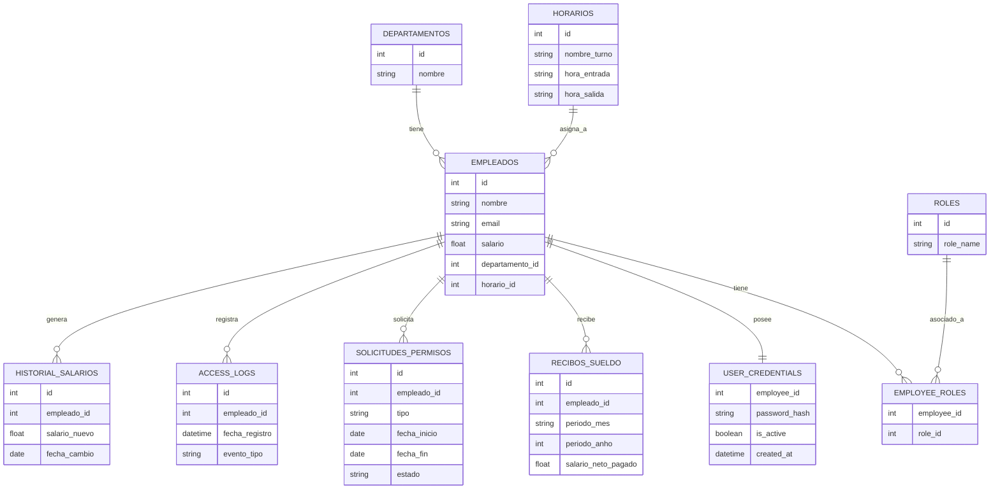

```mermaid
erDiagram
    DEPARTAMENTOS ||--o{ EMPLEADOS : tiene
    EMPLEADOS ||--o{ HISTORIAL_SALARIOS : genera
    EMPLEADOS ||--o{ ACCESS_LOGS : registra
    EMPLEADOS ||--o{ SOLICITUDES_PERMISOS : solicita
    EMPLEADOS ||--o{ RECIBOS_SUELDO : recibe
    HORARIOS ||--o{ EMPLEADOS : asigna_a
    EMPLEADOS ||--|| USER_CREDENTIALS : posee
    EMPLEADOS ||--o{ EMPLOYEE_ROLES : tiene
    ROLES ||--o{ EMPLOYEE_ROLES : asociado_a

    DEPARTAMENTOS {
        int id
        string nombre
    }

    EMPLEADOS {
        int id
        string nombre
        string email
        float salario
        int departamento_id
        int horario_id
    }

    HISTORIAL_SALARIOS {
        int id
        int empleado_id
        float salario_nuevo
        date fecha_cambio
    }

    ACCESS_LOGS {
        int id
        int empleado_id
        datetime fecha_registro
        string evento_tipo
    }

    SOLICITUDES_PERMISOS {
        int id
        int empleado_id
        string tipo
        date fecha_inicio
        date fecha_fin
        string estado
    }

    RECIBOS_SUELDO {
        int id
        int empleado_id
        string periodo_mes
        int periodo_anho
        float salario_neto_pagado
    }

    HORARIOS {
        int id
        string nombre_turno
        string hora_entrada
        string hora_salida
    }

    USER_CREDENTIALS {
        int employee_id
        string password_hash
        boolean is_active
        datetime created_at
    }

    EMPLOYEE_ROLES {
        int employee_id
        int role_id
    }

    ROLES {
        int id
        string role_name
    }
```